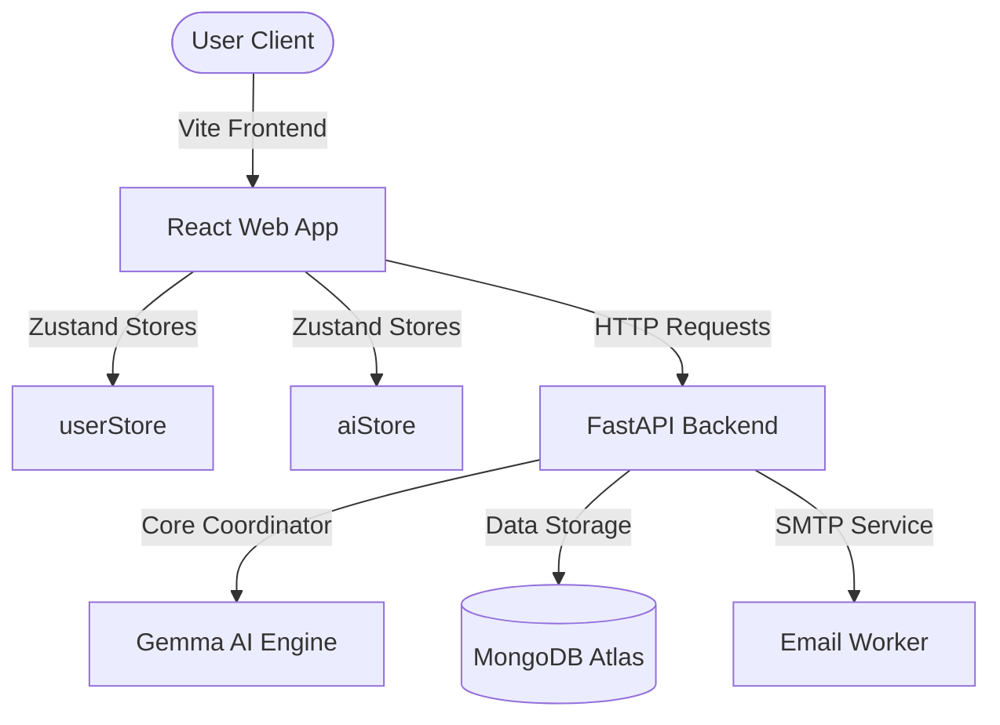

# FoodBridge AI 🌾

> **The Intelligent Food Redistribution Coordinator Powered by Gemma**

FoodBridge AI is a next-generation humanitarian logistics platform designed to eliminate food waste and streamline distribution to communities in need. By integrating **Gemma** as the central operations coordinator, the platform intelligently handles food inspection, allergen detection, shelf-life assessment, and matched routing to local shelters and food banks in real time.

---

## 📌 Table of Contents
1. [Problem Statement](#-problem-statement)
2. [The Solution](#-the-solution)
3. [Key Features](#-key-features)
4. [System Architecture](#-system-architecture)
5. [Tech Stack](#-tech-stack)
6. [Design System & Aesthetics](#-design-system--aesthetics)
7. [Installation & Setup](#-installation--setup)
8. [Commit History](#-commit-history)

---

## 🚨 Problem Statement
Every year, billions of tons of edible food are discarded by restaurants, hotels, and supermarkets, while millions of individuals face severe food insecurity. The primary bottleneck is not a lack of food, but **logistical coordination**:
- **Perishability**: Fresh food has a short shelf-life and must be matched and delivered within hours.
- **Safety**: Unlabeled allergens pose severe health risks to recipients.
- **Resource Constraints**: Volunteers and NGOs lack the capacity to inspect, catalog, and route food manually.
- **Logistics Matching**: Hot meals, fresh produce, and dry goods require different handling (e.g., refrigeration capacity).

---

## 💡 The Solution
FoodBridge AI serves as the **central intelligence layer** for food rescue operations:
- **Instant Photo Inspection**: Donors simply snap a picture and write a short description.
- **Gemma Coordinator Engine**: Gemma instantly identifies the food type, estimates servings, flags potential allergens, determines storage requirements (e.g., cold storage vs. shelf-stable), and calculates the remaining shelf-life.
- **Intelligent Routing**: The platform matches donation attributes with the active capacities of nearby shelters, ensuring perishables are directed only to facilities equipped to handle them.
- **Automated Communication**: The backend automatically drafts and dispatches multilingual emails to matched shelters, preparing volunteers for the incoming resource before it even arrives.

---

## ✨ Key Features

### 1. Gemma Optimization Pipeline
When a donor uploads a listing, a real-time vertical step-timeline (`AIDecisionTimeline`) animates Gemma's multi-step decision pipeline:
1. **Image Vector Scan** ➔ Validating image properties.
2. **Food Classification** ➔ Identifying category (e.g., Bakery, Produce, Dairy).
3. **Servings Estimation** ➔ Calculating the nutritional capacity.
4. **Shelf-Life Estimation** ➔ Determining expiration boundaries.
5. **Allergen Detection** ➔ Scanning description for gluten, dairy, nuts, etc.
6. **Urgency Mapping** ➔ Prioritizing logistics based on expiration.
7. **Routing Exclusions** ➔ Exclude orgs lacking necessary storage (e.g., cold storage).
8. **Receiver Matching** ➔ Matching with the closest compatible shelter.
9. **Email Notification Draft** ➔ Autogenerating notification copy.
10. **Log Dispatch** ➔ Recording the operations trace.

### 2. AI Explainability Report
Receivers and admins have access to the **Gemma Operations Report**—a structured document explaining the qualitative and quantitative logic behind every routing decision.

### 3. Demo Persona Switcher Banner
A sticky reference workspace banner allows judges and users to toggle instantly between:
- 👨‍🍳 **DONOR** (Rajesh Kumar, Restaurant Representative)
- 👩‍💼 **RECEIVER** (Sarah Jenkins, Shelter Coordinator)
- 🛡️ **ADMIN** (Global System Overseer)

---

## 🏗️ System Architecture



---

## 💻 Tech Stack
- **Frontend**: React (v18), Vite, TypeScript, Zustand (State Management), Tailwind CSS, Lucide Icons.
- **Backend**: FastAPI (Python 3.9+), MongoDB Atlas (PyMonster/PyMongo), Uvicorn.
- **AI Engine**: Google Gemini API (`gemini-2.0-flash`).
- **SMTP Worker**: Standard Python `smtplib` handling HTML/Plaintext template rendering.

---

## 🎨 Design System & Aesthetics
Following the **Sleek Minimalist Studio** design tokens:
- **Headings**: Serif (*Merriweather*) representing authority, editorial precision, and trust.
- **Body Text**: Clean geometric Sans-Serif (*Inter*) designed for readability.
- **Color Palette**:
  - **Matte Graphite** (`#121416`) for primary elements.
  - **Burnished Warm Bronze** (`#C39B62`) for highlights and active controls.
  - **Leaf Green** (`#5A8266`) for verified status indicators.
  - **Rust Crimson** (`#C86A5A`) for critical expiration alerts.
- **Shapes**: Sharp, architectural 4px border-radius. Avoids rounded pills to maintain a professional, institutional aesthetic.

---

## ⚙️ Installation & Setup

### Prerequisites
- Node.js >= 18
- Python >= 3.9
- pnpm package manager (`npm install -g pnpm`)

### 1. Repository Setup
```bash
git clone https://github.com/DNA-Coded/bridgefood.git
cd bridgefood
```

### 2. Backend Setup
1. Navigate to the api directory:
   ```bash
   cd apps/api
   ```
2. Install python dependencies:
   ```bash
   pip install -r requirements.txt
   ```
3. Configure your environmental properties in `.env`:
   ```env
   MONGODB_URI=your_mongodb_atlas_uri
   GEMINI_API_KEY=your_gemini_api_key
   USE_MOCK_ANALYSIS=false # Set to true for mock mode during offline tests
   ```
4. Run the development server:
   ```bash
   python -m uvicorn app.main:app --reload --port 8000
   ```

### 3. Frontend Setup
1. Navigate to the web directory:
   ```bash
   cd apps/web
   ```
2. Install pnpm packages:
   ```bash
   pnpm install
   ```
3. Run the development server:
   ```bash
   pnpm dev
   ```
   Open [http://localhost:5173/](http://localhost:5173/) in your browser.

---

## 📝 Commit History
The repository was built sequentially under the author `DeepSaha25` (`ideepsaha25@gmail.com`) with **15 meaningful commits** reflecting the codebase development:
1. `feat: initialize monorepo configuration and workspace`
2. `docs: add database and development documentation`
3. `feat: add core API configuration and schemas`
4. `feat: implement Gemma AI service coordinator`
5. `feat: implement donations and organizations API routers`
6. `feat: implement email delivery engine and SMTP worker`
7. `feat: complete backend main entry point and CORS configuration`
8. `feat: define shared TypeScript types package`
9. `feat: configure frontend Vite development environment`
10. `feat: implement frontend API client and stores`
11. `feat: implement UI design system and core components`
12. `feat: implement AI analysis timeline and status panels`
13. `feat: implement core dashboards and donation creation form`
14. `feat: apply Sleek Minimalist Studio styling tokens and theme`
15. `feat: refine landing page hero with full-screen background image`
