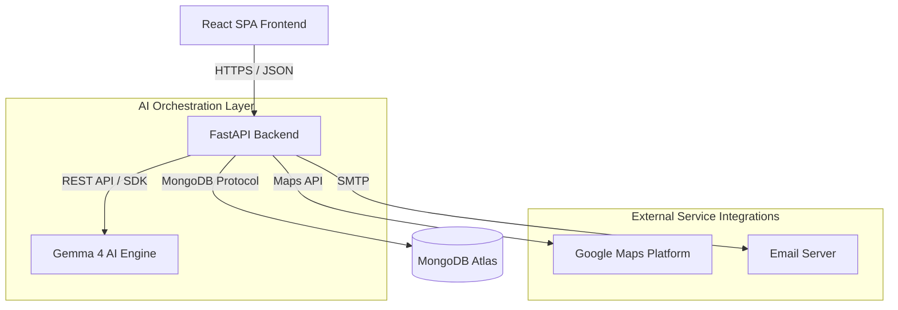
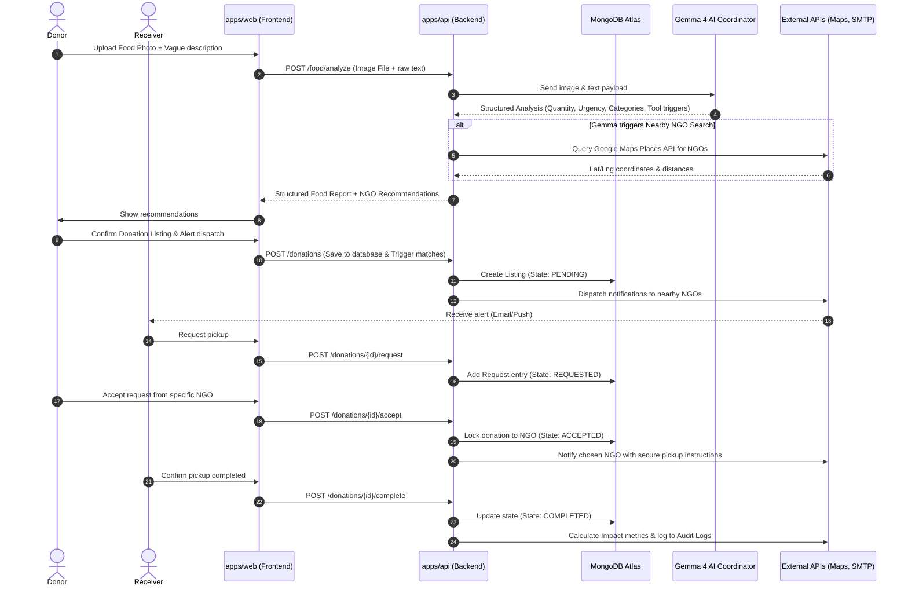

# FoodBridge AI - High-Level Architecture

This document describes the high-level architecture, systems integrations, AI operational boundaries, and data flow of **FoodBridge AI**.

---

## 1. System Topology

FoodBridge AI is designed as a modern, decoupled monorepo architecture separating client-side presentation, API endpoints, shared configurations, and the AI orchestration framework.



### Components Summary

1. **Frontend (apps/web)**: React + TypeScript + Vite Single Page Application. It manages state locally and renders the donor/recipient workflows.
2. **Backend (apps/api)**: FastAPI serving REST API endpoints. Interacts with the database, manages integration calls, and formats tasks for Gemma 4.
3. **Database (MongoDB Atlas)**: Storing user profiles, verification records, real-time donation states, notifications, and LLM coordinator trace logs.
4. **AI Engine (Gemma 4)**: Executes structured content classification, urgency extraction, and provides tool calling requests (orchestrated by backend).

---

## 2. Data Flow: End-to-End Donation Lifecycle



---

## 3. AI Architecture: Gemma as an Operations Coordinator

Gemma 4 does not communicate via free-form conversation loops. It performs structured data transformations and emits tool execution directives.

### Operations Pipeline
1. **Sanitization & Safety Check**: Validate description strings to prevent prompts injection.
2. **Object Identification & Quantitatives**: Parse raw image arrays to identify specific products and cross-examine descriptions to estimate volume.
3. **Operational Context Assessment**:
   - Determine **Donation Urgency** (Highly Urgent: < 4 hours, Urgent: < 12 hours, Normal: < 24 hours).
   - Extract **Recipient Categories** (e.g., Human vs. Animal feed, hot-meal vs. dry-goods storage requirements).
4. **Structured JSON Output**: Generate schema-compliant JSON payloads for backend processors to act on directly.

---

## 4. Function Calling & Integration Interface

When Gemma decides that a task requires external data, it returns a tool instruction object specifying the target operation.

```json
{
  "tool": "NearbyNgoSearch",
  "parameters": {
    "latitude": 37.7749,
    "longitude": -122.4194,
    "radius_meters": 5000,
    "food_requirements": ["veggie", "cooked"]
  }
}
```

The FastAPI backend interceptor processes these payloads:
* **Google Maps**: Resolves proximity grids and transit routing constraints.
* **Translation**: Translates messages to matching locales.
* **Email Service**: Dispatches templates using standardized transactional email patterns.
* **Impact Calculator**: Evaluates metrics (CO2 saved, equivalent meals served).
