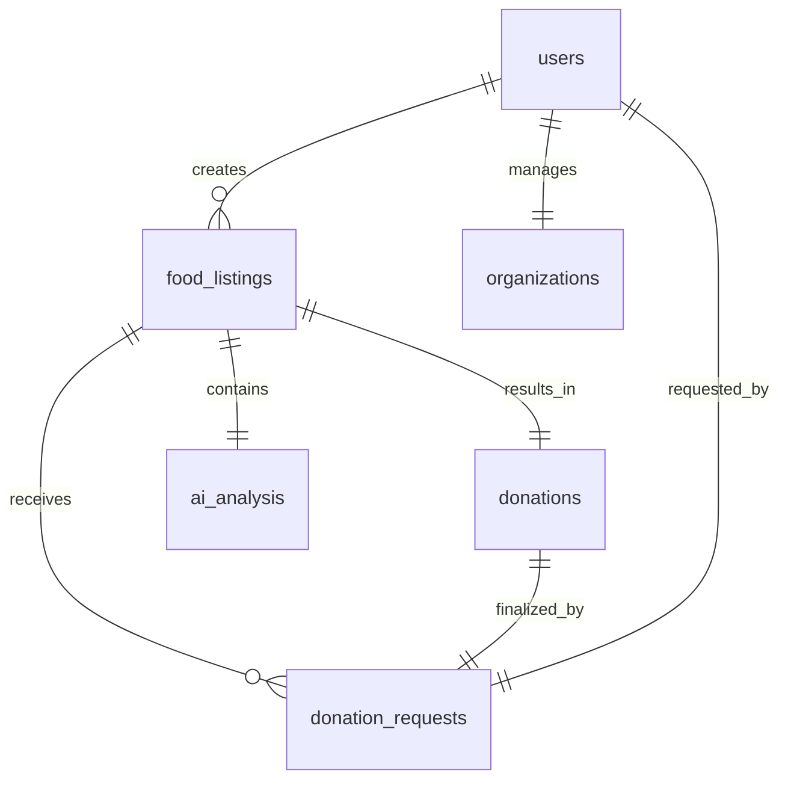

# Database Design Specifications

This document outlines the MongoDB schema structure, collection models, indices, and data relationships for **FoodBridge AI**.

---

## 1. Entity Relationship Model

Although MongoDB is document-based, we maintain structured relations using referenced ObjectIDs (`DBRef` style).



---

## 2. Collections Schemas

### `users`
Tracks both Donors and Recipient representatives.
```json
{
  "_id": "ObjectId",
  "email": "string (unique)",
  "name": "string",
  "role": "string (Enum: DONOR | RECEIVER | ADMIN)",
  "phone": "string",
  "is_verified": "boolean",
  "created_at": "date",
  "updated_at": "date"
}
```
* **Indices**:
  * `{ "email": 1 }` (Unique index)

---

### `organizations`
Profiles for NGOs, Food Banks, and shelters. Attached to a user with role `RECEIVER`.
```json
{
  "_id": "ObjectId",
  "user_id": "ObjectId (ref: users)",
  "name": "string",
  "category": "string (Enum: NGO | FOOD_BANK | SHELTER | ANIMAL_SHELTER)",
  "location": {
    "type": "string (Point)",
    "coordinates": ["double (longitude)", "double (latitude)"]
  },
  "address": {
    "street": "string",
    "city": "string",
    "zip": "string"
  },
  "dietary_preferences": ["string"],
  "is_approved": "boolean"
}
```
* **Indices**:
  * `{ "location": "2dsphere" }` (Geospatial index for proximity searches)
  * `{ "user_id": 1 }`

---

### `food_listings`
The primary post generated by a donor.
```json
{
  "_id": "ObjectId",
  "donor_id": "ObjectId (ref: users)",
  "raw_description": "string",
  "image_url": "string (nullable)",
  "analysis_id": "ObjectId (ref: ai_analysis)",
  "location": {
    "type": "string (Point)",
    "coordinates": ["double (longitude)", "double (latitude)"]
  },
  "pickup_window": {
    "start_time": "date",
    "end_time": "date"
  },
  "state": "string (Enum: PENDING | ACTIVE | REQUESTED | ACCEPTED | COMPLETED | EXPIRED | CANCELLED)",
  "created_at": "date"
}
```
* **Indices**:
  * `{ "location": "2dsphere" }`
  * `{ "state": 1, "pickup_window.end_time": 1 }` (Used for matching current, unexpired postings)

---

### `ai_analysis`
Stores Gemma 4 execution logs, extracted metadata, and tool outcomes.
```json
{
  "_id": "ObjectId",
  "listing_id": "ObjectId (ref: food_listings, nullable)",
  "raw_input_text": "string",
  "extracted_data": {
    "item_name": "string",
    "quantity_kg": "double",
    "urgency": "string (Enum: NORMAL | URGENT | HIGH)",
    "allergens": ["string"],
    "categories": ["string"]
  },
  "tool_calls": [
    {
      "tool_name": "string",
      "args": "document",
      "result": "document",
      "executed_at": "date"
    }
  ],
  "safety_flagged": "boolean",
  "execution_duration_ms": "int"
}
```
* **Indices**:
  * `{ "listing_id": 1 }`

---

### `donation_requests`
Maintains entries when a receiver requests an active listing.
```json
{
  "_id": "ObjectId",
  "listing_id": "ObjectId (ref: food_listings)",
  "receiver_id": "ObjectId (ref: users)",
  "message": "string",
  "status": "string (Enum: PENDING | ACCEPTED | REJECTED | WITHDRAWN)",
  "requested_at": "date"
}
```
* **Indices**:
  * `{ "listing_id": 1, "receiver_id": 1 }` (Unique compound constraint to prevent duplicate requests)

---

### `donations`
Completed transaction records storing pickup validation and tracking impact details.
```json
{
  "_id": "ObjectId",
  "listing_id": "ObjectId (ref: food_listings)",
  "accepted_request_id": "ObjectId (ref: donation_requests)",
  "pickup_code": "string",
  "completed_at": "date",
  "impact": {
    "co2_saved_kg": "double",
    "meals_served": "int"
  }
}
```
* **Indices**:
  * `{ "listing_id": 1 }`

---

### `notifications`
Audit record of push, SMS, and email alerts sent.
```json
{
  "_id": "ObjectId",
  "user_id": "ObjectId (ref: users)",
  "type": "string (Enum: EMAIL | SMS | PUSH)",
  "title": "string",
  "body": "string",
  "status": "string (Enum: SENT | FAILED | READ)",
  "sent_at": "date"
}
```

---

### `audit_logs`
Immutable database trace logs for security tracking.
```json
{
  "_id": "ObjectId",
  "actor_id": "ObjectId (ref: users, nullable)",
  "action": "string",
  "resource": "string",
  "payload": "document",
  "timestamp": "date"
}
```
* **Indices**:
  * `{ "timestamp": -1 }`
